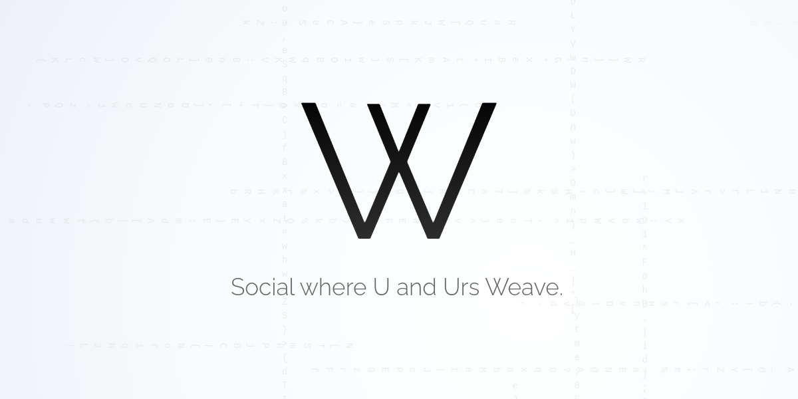

# W - Decentralized Social on WeaveDB

W is a fully decentralized social platform built on top of [WeaveDB](https://weavedb.dev).

It is a complete, functional alternative to [X](https://x.com).

With WeaveDB, building apps is insanely simple. All it takes is [4 JSON configuration files](./db/db).

- [Data Schemas](./db/db/schemas.js)
- [Auth Rules](./db/db/auth.js)
- [Indexes](./db/db/indexes.js)
- [Triggers](./db/db/triggers.js)

That’s it. No smart contracts. No backend infrastructure. The entire equivalent of X can be defined in just a few hundred lines of JSON. The database itself is the smart contract — it handles code as data.

This radical simplicity is perfectly aligned with LLMs like Claude and ChatGPT. An LLM can build a fully functional, complex social app backend in under three minutes. Yes, you don't even have to write it.

This is a paradigm shift in app development. WeaveDB will ignite a Cambrian explosion of decentralized apps.


## Running App Loccaly

You should be running a weavedb rollup node on your local machine.

- [Runnint Rollup Node](https://docs.weavedb.dev/build/quick-start#running-rollup-node)


### Set up DB

Clone the repo.

```bash
git clone https://github.com/weavedb/w.git
cd w/db && yarn
```
Deploy a database.

```bash
yarn deploy --wallet PATH_TO_WALLET
```
Note the database ID.

Initialize the DB.

```bash
yarn initdb --wallet PATH_TO_WALLET --id DB_ID
```

The owner account is registered, and given 100 invites.


### Run App

Go to the app directory and install dependencies.

```bash
cd ../app && yarn
```

Create `.env.local`.

```bash
NEXT_PUBLIC_DB_ID="xyz"
NEXT_PUBLIC_ROLLUP="http://localhost:6364"
NEXT_PUBLIC_HB="http://localhost:10001"
NEXT_PUBLIC_SCAN="http://localhost:4000"
NEXT_PUBLIC_MODE="open"
```
Run the app.

```bash
yarn dev
```

Now, W is running at [localhost:3000](http://localhost:3000).

